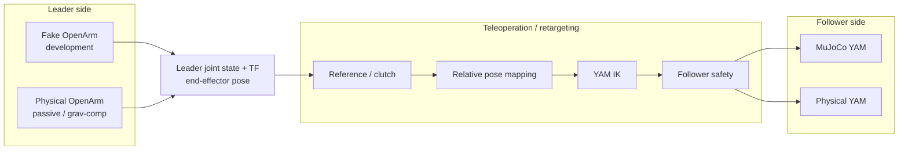

# mobile_bimanual_ros2

ROS 2 Jazzy workspace for a mobile bimanual manipulation platform.

## Target architecture



The intended development progression is:

```text
Fake OpenArm
    -> retargeting
    -> simulated YAM

Physical passive OpenArm
    -> same retargeting
    -> physical YAM
```

OpenArm has seven arm joints while YAM v1 has six, so follower control will be based
on end-effector pose retargeting rather than direct joint-to-joint copying.

## Simulation environments

MuJoCo will be used for environment and robot simulation.

This supports several development modes:

## Development environment

The supported development environment is the repository devcontainer.

It provides the shared ROS, compiler, simulation, OpenArm, and editor tooling
while allowing people to use their preferred editor.

### Terminal / Neovim

```bash
./scripts/dev up
./scripts/dev nvim
```

When a host Neovim configuration exists at `~/.config/nvim`, `scripts/dev`
mounts it into the container. Neovim itself and development tools run inside
the container so the editor sees the same ROS headers, Python packages, and
compiler environment as the build.

Open another shell with:

```bash
./scripts/dev shell
```

### VS Code

Install Docker and the VS Code Dev Containers extension, open this repository,
then run:

```text
Dev Containers: Reopen in Container
```

### Linux only hardware access

On Linux, `scripts/dev` selects the Linux devcontainer configuration, which uses
host networking so ROS nodes can access SocketCAN interfaces such as `can0` and
`can1`.

See [`docs/DEVELOPMENT.md`](docs/DEVELOPMENT.md) for the full workflow,
macOS limitations, container lifecycle, editor configuration, and the native
fallback.

## Build

The devcontainer imports the pinned OpenArm upstream repositories and builds the
supported package subset during initial setup.

For normal development:

```bash
./scripts/dev shell
./scripts/build.sh
```

The build script generates a root `compile_commands.json` for clangd when CMake
packages provide compile databases.

## Current OpenArm baseline

### Fake hardware

```bash
./scripts/dev shell

ros2 launch mobile_bimanual_bringup openarm_fake.launch.py
```

Verify from another container shell:

```bash
ros2 control list_controllers
ros2 control list_hardware_components -v
ros2 control list_hardware_interfaces
ros2 topic echo /joint_states --once
```

The fake bringup is headless by default. Set `launch_rviz:=true` only in an
environment where an RViz GUI is desired.

### Current command/supervisor prototype

```bash
ros2 launch mobile_bimanual_bringup control.launch.py
```

The current supervisor is an OpenArm command-mode readiness prototype. It is
being preserved but not expanded until the leader/follower teleoperation stack
has defined the final readiness and fault requirements.

For scripted fake-arm motion:

```bash
ros2 run mobile_bimanual_control sinusoid_position_request
```

This path is useful for testing the future teleoperation pipeline because fake
hardware cannot be physically moved by hand.

## YAM / MuJoCo development

The current next milestone is one I2RT YAM v1 arm controlled through ROS 2:

```text
ROS command
    -> YAM ros2_control position controller
    -> mujoco_ros2_control
    -> MuJoCo YAM
```

The I2RT YAM v1 model is the source of truth for project geometry and
kinematics. Its arm model has six joints (`joint1` through `joint6`) and an
end-effector mount named `gripper`.

The project should keep robot assets and scenes separate:

```text
mobile_bimanual_description/
    urdf/
    mujoco/
        yam_v1/

mobile_bimanual_sim/
    config/
    launch/
    scenes/
```

`mobile_bimanual_description` owns robot descriptions/assets.

`mobile_bimanual_sim` owns simulation-specific controller configuration,
launching, worlds/scenes, object layouts, reset behavior, and simulator
integration.

## Foxglove

Start the bridge:

```bash
ros2 launch mobile_bimanual_bringup observability.launch.py
```

Connect Foxglove to:

```text
ws://localhost:8765
```

## Recording

Current MCAP recording:

```bash
./scripts/record_mcap.sh
```

As the teleoperation/simulation stack is added, recording will expand to include:

- leader joint state
- leader end-effector pose
- desired follower end-effector pose
- desired YAM joint command
- actual YAM joint state
- clutch / teleoperation state
- simulated object state
- RGB/depth images
- task / episode metadata

## Classic CAN hardware setup

Run CAN configuration on the Linux hardware host before launching the
devcontainer:

```bash
./scripts/can_up.sh
./scripts/can_check.sh
./scripts/dev up
```

Expected for each OpenArm bus:

- Classical CAN (`mtu 16`)
- 1 Mbps
- `ERROR-ACTIVE`
- no CAN-FD flag

See [`docs/CAN20_OPENARM_ROS2.md`](docs/CAN20_OPENARM_ROS2.md).

## If YAM meshes in Foxglove looks wrong

See [`docs/YAM_MESH_TROUBLESHOOTING.md`](docs/YAM_MESH_TROUBLESHOOTING.md).

## Dependency locking

Development imports the committed `upstream.repos.lock`.

Update the lock intentionally only after validating newer upstream revisions:

```bash
vcs export --exact src > upstream.repos.lock
```

The repository currently applies small reproducible patches to pinned OpenArm
sources for the lab's CAN configuration and headless bringup requirements.

## Documentation

- [Development workflow](docs/DEVELOPMENT.md)
- [Code guidelines](docs/CODE_GUIDELINES.md)
- [Boot process](docs/BOOT_PROCESS.md)
- [CAN 2.0 OpenArm notes](docs/CAN20_OPENARM_ROS2.md)
- [Data visualization and recording](docs/DATA_VISUALIZATION_AND_RECORDING.md)
- [Roadmap](docs/ROADMAP.md)

## Roadmap

See [`docs/ROADMAP.md`](docs/ROADMAP.md) for the current milestone sequence.
