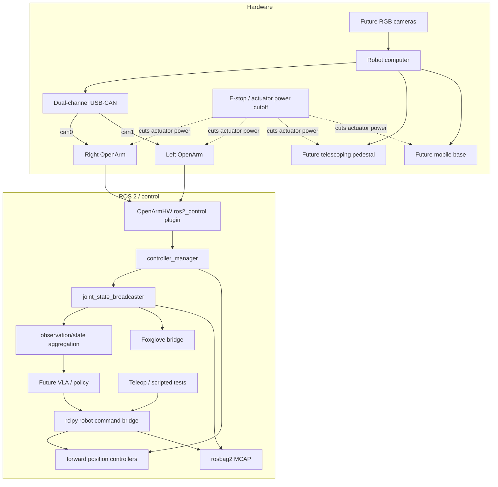

# mobile_bimanual_ros2

ROS 2 Jazzy workspace for a mobile bimanual manipulation platform.

## Architecture



## Initial setup

Assumptions: Ubuntu 24.04 / Kubuntu, ROS 2 Jazzy, zsh.

```bash
./scripts/setup_host.sh
source /opt/ros/jazzy/setup.zsh
./scripts/import_upstream.sh
./scripts/patch_openarm_can20.sh
./scripts/build.sh
source install/setup.zsh
```

The CAN patch is temporary and exists because this project uses classic CAN 2.0 while current upstream OpenArm ros2_control descriptions default `can_fd` to true. See `docs/CAN20_OPENARM_ROS2.md`.

## Bring up fake hardware first

```bash
source /opt/ros/jazzy/setup.zsh
source install/setup.zsh
ros2 launch mobile_bimanual_bringup openarm_fake.launch.py
```

In another terminal:

```bash
source /opt/ros/jazzy/setup.zsh
source install/setup.zsh
ros2 control list_controllers
ros2 control list_hardware_components -v
ros2 control list_hardware_interfaces
ros2 topic echo /joint_states --once
```

## Foxglove

```bash
ros2 launch mobile_bimanual_bringup observability.launch.py
```

Connect Foxglove to `ws://localhost:8765`.

## Classic CAN hardware setup

```bash
./scripts/can_up.sh
./scripts/can_check.sh
```

Expected for each interface: `mtu 16`, `bitrate 1000000`, `state ERROR-ACTIVE`, and no `<FD>` flag.
`mtu 16` indicates that the interface is configured for Classical CAN (CAN 2.0)

## Dependency locking

`upstream.repos` starts on upstream `main` while I'm working to set this project up. Once that's done, locking version can be done with:

```bash
vcs export --exact src > upstream.repos.lock
```

I'll commit `upstream.repos.lock` so others can import that file instead of `upstream.repos`.

## Roadmap

See [`docs/ROADMAP.md`](docs/ROADMAP.md).

## Code Guideline

See [`docs/CODE_GUIDELINES.md`](/docs/CODE_GUIDELINES.md)
