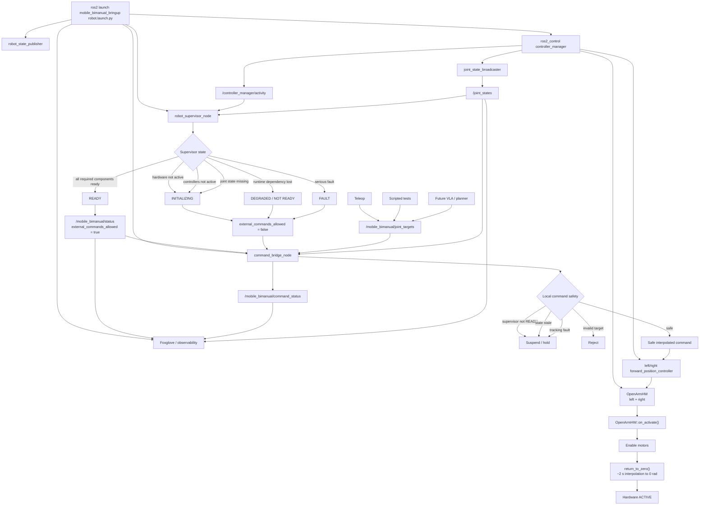

# Boot process


## Current process

1. Launch with openarm bringup

```zsh
ros2 launch openarm_bringup openarm.bimanual.launch.py \
arm_type:=v1.0 \
use_fake_hardware:=false \
right_can_interface:=can0 \
left_can_interface:=can1 \
robot_controller:=forward_position_controller
```

2. Run publisher that remaps openarm joint indices to actual named fields
```zsh
ros2 run mobile_bimanual_control named_joint_state_publisher
```

3. Launch local foxglove server for live data
```zsh
ros2 launch mobile_bimanual_bringup observability.launch.py
```

4. Launch lab-side high level controller
```zsh
ros2 launch mobile_bimanual_bringup control.launch.py
```

5. Run a trajectory generator (optional)
```zsh
ros2 run mobile_bimanual_control sinusoid_position_request
```

These nodes and which package they belong can be changed, the current ones are just prototypes.

## Proposed process




