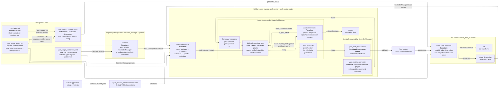

# Current MuJoCo Sim Setup

```mermaid
---
config:
  layout: elk
---
flowchart LR

    %% ============================================================
    %% Configuration / startup
    %% ============================================================

    subgraph CONFIG["Configuration files"]
        direction TB

        SCENE["yam_table.xml<br/><b>MuJoCo scene</b><br/>robot + actuators + environment"]

        XACRO["yam_v1.ros2_control.xacro<br/><b>ROS robot / hardware description</b><br/>links + joints + ros2_control config"]

        YAML["yam_single_controllers.yaml<br/><b>Controller configuration</b><br/>controller types + joints + update rate"]

        LAUNCH["yam_single.launch.py<br/><b>System orchestration</b><br/>build paths + run Xacro + start processes"]
    end


    %% ============================================================
    %% robot_state_publisher process
    %% ============================================================

    subgraph RSP_PROCESS["ROS process: robot_state_publisher"]
        direction TB

        RSP["robot_state_publisher<br/><b>Function:</b><br/>publish robot description<br/>and compute TF from joint states"]

        ROBOT_DESC["/robot_description<br/>Generated URDF"]

        TF["/tf<br/>link transforms"]
    end


    %% ============================================================
    %% Main ros2_control + MuJoCo process
    %% ============================================================

    subgraph CONTROL_PROCESS["ROS process: mujoco_ros2_control / ros2_control_node"]
        direction TB

        CM["ControllerManager<br/><b>Function:</b><br/>owns hardware + controllers<br/>runs read → update → write loop"]

        subgraph HARDWARE["Hardware owned by ControllerManager"]
            direction TB

            MJI["MujocoSystemInterface<br/><b>ros2_control hardware plugin</b><br/>makes MuJoCo look like virtual hardware"]

            STATE_IF["State interfaces<br/>joint1/position<br/>joint1/velocity<br/>joint1/effort<br/>..."]

            CMD_IF["Command interfaces<br/>joint1/position<br/>joint2/position<br/>..."]

            MUJOCO["MuJoCo simulation<br/><b>Function:</b><br/>physics integration<br/>qpos / qvel / actuators / contacts"]
        end

        subgraph CONTROLLERS["Controllers owned by ControllerManager"]
            direction TB

            JSB["joint_state_broadcaster<br/><b>JointStateBroadcaster plugin</b><br/>reads state interfaces"]

            YAM_CTRL["yam_position_controller<br/><b>ForwardCommandController plugin</b><br/>writes position command interfaces"]
        end

        CLOCK["/clock<br/>simulation time"]
    end


    %% ============================================================
    %% Spawner helper process
    %% ============================================================

    subgraph SPAWNER_PROCESS["Temporary ROS process: controller_manager / spawner"]
        direction TB

        SPAWNER["spawner<br/><b>Function:</b><br/>asks existing ControllerManager<br/>to load/configure/activate controllers"]
    end


    %% ============================================================
    %% ROS-facing topics
    %% ============================================================

    JOINT_STATES["/joint_states<br/>sensor_msgs/JointState"]

    COMMANDS["/yam_position_controller/commands<br/>desired YAM joint positions"]

    APP["Future application<br/>teleop / IK / tests"]


    %% ============================================================
    %% Startup / configuration flow
    %% ============================================================

    LAUNCH -->|"runs Xacro with<br/>mujoco_model := scene path"| XACRO
    LAUNCH --> RSP
    LAUNCH --> CM
    LAUNCH --> SPAWNER

    SCENE -->|"path inserted into<br/>hardware params"| XACRO

    XACRO -->|"generated URDF"| RSP
    RSP -->|"publishes"| ROBOT_DESC

    ROBOT_DESC -->|"ControllerManager reads<br/><ros2_control> section"| CM

    YAML -->|"ControllerManager params"| CM
    YAML -->|"controller params"| SPAWNER

    SPAWNER -->|"load + configure + activate"| CM


    %% ============================================================
    %% Hardware initialization
    %% ============================================================

    CM -->|"loads hardware plugin"| MJI

    MJI -->|"reads mujoco_model param<br/>and loads scene"| MUJOCO

    MJI --> STATE_IF
    CMD_IF --> MJI


    %% ============================================================
    %% State flow: MuJoCo -> ROS
    %% ============================================================

    MUJOCO -->|"q, qdot, effort"| MJI

    MJI -->|"read()"| STATE_IF

    STATE_IF -->|"reads"| JSB

    JSB -->|"publishes"| JOINT_STATES

    JOINT_STATES -->|"subscribes"| RSP

    RSP -->|"forward kinematics"| TF

    MUJOCO -->|"simulation clock"| CLOCK


    %% ============================================================
    %% Command flow: ROS -> MuJoCo
    %% ============================================================

    APP -->|"publishes desired joints"| COMMANDS

    COMMANDS -->|"subscribes"| YAM_CTRL

    YAM_CTRL -->|"writes"| CMD_IF

    MJI -->|"write() / actuator targets"| MUJOCO
```
